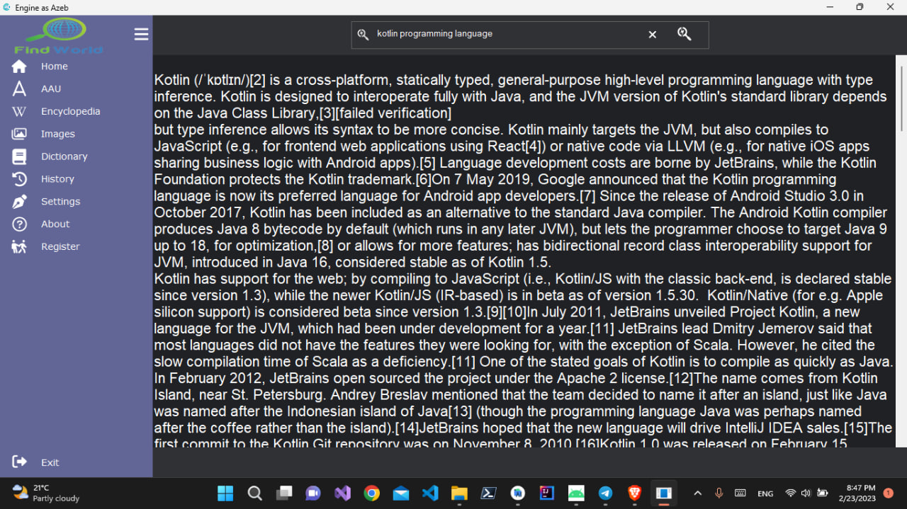

                                                     BELAH SEARCH ENGINE

Welcome to BELAH Search Engine! This is a simple search engine desktop application created using Winforms in C#. This app was made by a team of five students from the School of Information Sciences at Addis Ababa University, including:
 <ol>
  <li>Azeb Mihiretie</li>
  <li>Esubalew Chekol</li>
  <li>Liydia Fikrie</li>
  <li>Hayat Ebrahim</li>
  <li>Bereket Gebeyaw</li>
  </ol>

The purpose of this search engine is to allow users to search through specific websites using web scraping technology. Currently, the app is implemented to crawl through Wikipedia, the AAU website, and a certain dictionary website. By registering with the app, users can have their activities tracked.

This project was submitted to the C# instructor at Addis Ababa University as a 3rd year first semester final project. We are proud to share this app on GitHub as a learning resource for other students. Our hope is to encourage other students to refrain from copying code and instead use our project as inspiration for their own development projects. Thank you for using BELAH Search Engine!

<b>Some <a href="https://github.com/Esubaalew/BELAH-Search-Engine/tree/master/ExampleImages">Images</a> examples of our Search engine</b>

<figure>

  <figcaption><i>Fig.1 - Results of 'Addis Ababa' query, on AAU search section.</i></figcaption>
</figure>

  <figcaption><i>Fig.2 -AAU search page on BELAH search.</i></figcaption>
</figure>

  <figcaption><i>Fig.3 -About Dialogue of the Engine.</i></figcaption>
</figure>

  <figcaption><i>Fig.4 -About Dialogue Showing the authors of the app.</i>
  <em>The authors of the app of course are the following </em>
  <ol>
  <li>Azeb Mihiretie</li>
  <li>Esubalew Chekol</li>
  <li>Liydia Fikrie</li>
  <li>Hayat Ebrahim</li>
  <li>Bereket Gebeyaw</li>
  </ol>
  </figcaption>
</figure>

  
  <figcaption><i>Fig.5 Results of 'head' query, on Dictionary search section..</i> 
 you can also find the dictionary page photo <a href='https://github.com/Esubaalew/BELAH-Search-Engine/blob/master/ExampleImages/dicpage.jpg'>here</a>
</figcaption>
</figure>

  <figcaption><i>Fig.6 Results of 'Github' query, on ENCYCLOPEDIC search section..</i> </figcaption>
</figure>

  
  <figcaption><i>Fig.7 Results of 'Kotlin Programming Langauge' query, on ENCYCLOPEDIC search section..</i> </figcaption>
</figure>

<figure>

  
  <figcaption><i>Fig.8  ENCYCLOPEDIC search section.</i> </figcaption>
</figure>

<figure>

  
  <figcaption><i>Fig.9 Results of 'Africa' query, on Image search section..</i> </figcaption>
</figure>

<figure>

  
  <figcaption><i>Fig.10 Register Dialog</i> </figcaption>
</figure>

<figure>

  
  <figcaption><i>Fig.11 Register Dialog</i> </figcaption>
</figure>

<figure>

  
  <figcaption><i>Fig.12 Login Dialog</i> </figcaption>
</figure>

